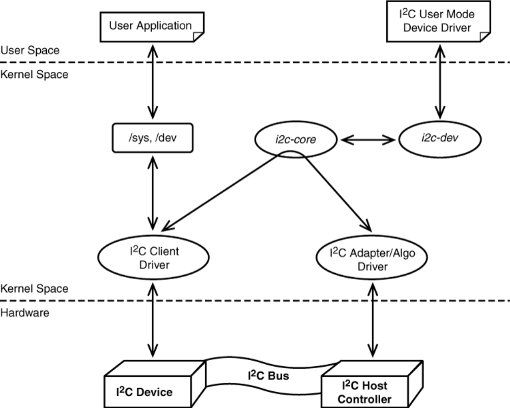

# I²C on Linux

## Introduction to I²C Drivers in Linux

The I²C (Inter-Integrated Circuit) subsystem in Linux provides a structured way for the kernel to communicate with I²C devices—peripherals that share a common two-wire bus consisting of data (SDA) and clock (SCL) lines. In typical configurations, **Linux acts as the bus master**, initiating and managing communication with multiple **slave devices** such as sensors, EEPROMs, and ADCs.

Unlike PCI or USB, I²C devices are **not self-discoverable**. The kernel must be explicitly informed about each device's presence and address on the bus. These devices are often integrated into embedded platforms, and as such, are handled similarly to **platform devices**. However, due to the unique nature of I²C's hardware protocol and signaling, the Linux kernel defines a **separate I²C subsystem** to manage bus-level interactions and device communication.

At the core of the I²C subsystem is a clean separation of concerns:

* The **I²C controller hardware** (or adapter) is abstracted by an *I²C adapter driver*, often implemented as a platform driver. This controller is responsible for electrical signaling and low-level bus protocol management.
* The **I²C peripheral device** (e.g., a temperature sensor) is represented by an `i2c_client`, which connects to a corresponding `i2c_driver` in the kernel.
* The communication logic between the driver and the hardware is implemented in an **I²C algorithm**.

This layered architecture makes it possible to write modular, portable drivers for I²C devices, regardless of the specific bus controller hardware. Developers can add new I²C devices through board files, device trees, or dynamically at runtime via sysfs, as long as the correct driver is registered with the subsystem.

In the sections below, you'll explore each of these concepts—buses, devices, drivers, and communication APIs—in detail. You'll also see how the I²C subsystem relates to platform drivers and how to instantiate devices both statically and dynamically within the kernel.


The I²C subsystem allows Linux to act as the master and all connected devices as slaves. These devices communicate over the shared I²C bus.

When discussing I²C, we use the following terminology:

* **Bus** → *Algorithm*, *Adapter*
* **Device** → *Driver*, *Client*

## How does an I²C device differ from a platform device?

An I²C device is a specific example of a platform device. However, the complexities of the I²C protocol are abstracted by a piece of hardware called the *I²C controller*, which manages the physical connection and communication.
The driver responsible for configuring and managing the I²C controller is typically a *platform driver*, and the controller itself is a platform device.

If an I²C device does not fit into the standard I²C controller model, it may need to be implemented as a platform driver with customized behavior.

## I²C Algorithm

An algorithm driver contains generalized logic that can be reused by multiple I²C adapters.
Its main responsibility is to perform read and write operations using I²C message formats to the underlying hardware.

Each specific adapter driver either uses a shared algorithm driver or includes its own implementation.
Three common algorithm implementations are `pca`, `pcf`, and *bitbanging*.
Bitbanging uses GPIO lines directly, while the others interact with dedicated I²C controller chips.

The algorithm is represented by the structure `i2c_algorithm`, which defines function pointers such as `master_xfer` for I²C transfers and `smbus_xfer` for SMBus-style messages.

## I²C Adapter

Multiple I²C buses may exist on a system. Each one is represented by a `struct i2c_adapter` (see `include/linux/i2c.h`).
Each adapter is identified by a *bus number* and implements the I²C algorithm used to communicate with devices.

The adapter supports either I²C messages or SMBus (System Management Bus) messages. Modern PCs rely on SMBus to connect devices like RAM modules or EEPROMs. SMBus is essentially a subset of the I²C protocol.

In a system with three I²C buses—two managed by controller chips and one via bitbanging—there would be three `i2c_adapter` instances and two `i2c_algorithm` instances.

## I²C Client

Each device connected to an I²C bus is represented by a `struct i2c_client` (in `include/linux/i2c.h`).
This structure is often defined in board-specific code (e.g., `arch/arm/mach.../board-omap...c`).

The device has a fixed I²C address (e.g., 0x14), a *name*, and possibly an *IRQ* number. These are all used during driver binding and interrupt handling.

The client must be linked to the appropriate `i2c_adapter` to know which bus it resides on.
Since the hardware exists physically, the client is typically declared statically or via device tree.

(See the [I²C Board Information](#i²c-board-information) section for more on this.)

### I²C Board Information

This is where the `i2c_client` is described using `struct i2c_board_info` (in `include/linux/i2c.h`).
The `type` field names the device and is copied into the `i2c_client`. The `addr` field is the device's I²C address, and `irq` specifies its interrupt line.

These structures are usually declared as arrays:

```c
static struct i2c_board_info z23_devices[] = {
	{
		.type = eeprom_abc,
		.addr = 0x28,
		.irq = 5,
	},
	{
		.type = adc_efg,
		.addr = 0x29,
	},
};
```

The kernel reads this information during boot.
The `i2c_client` is created when the associated `i2c_adapter` is registered.
It’s also possible to manually add I²C clients that are not known at boot time.


## I²C Driver

Each device has a corresponding driver, represented by `struct i2c_driver` (in `include/linux/i2c.h`).

The `driver.name` must match the client’s `type` field. The driver includes a `probe` function that is called when a matching client is found.

Example:

```c
static struct i2c_driver adc_driver = {
	.driver = {
		.name = adc_efg,
		.owner = THIS_MODULE,
	},
	.probe = adc_probe,
};
```

Reference diagram of the I²C subsystem:
> 


## I²C Device Registration

### If the bus number is known:

```c
int i2c_register_board_info(int busnum, struct i2c_board_info *info, unsigned len);

* `busnum`: Bus number identifying the `i2c_adapter`
* `info`: Array of `i2c_board_info`
* `len`: Length of the array

### If the bus number is not known, but the adapter is available:

```c
struct i2c_client *i2c_new_device(struct i2c_adapter *adap, struct i2c_board_info const *info);
```

Also, register the driver with the subsystem:

```c
i2c_add_driver(struct i2c_driver *drv);
```

This matches the driver’s name to all `i2c_client` entries. On a match, the driver’s `probe` function is called.


## Communicating on the I²C Bus

### Reading

```c
i2c_smbus_read_byte_data(struct i2c_client *client, u8 command);
i2c_smbus_read_word_data(struct i2c_client *client, u8 command);
```

### Writing

```c
i2c_smbus_write_byte_data(struct i2c_client *client, u8 command, u8 data);
i2c_smbus_write_word_data(struct i2c_client *client, u8 command, u16 data);
```


## Instantiating I²C Devices

There are multiple ways to declare or create I²C devices:

1. **Static definition via board file**
Declare device by bus number in `i2c_board_info` found in `arch/` board code

```c
static struct i2c_board_info h4_i2c_board_info[] __initdata = {
   {
           I2C_BOARD_INFO("isp1301_omap", 0x2d),
           .irq            = OMAP_GPIO_IRQ(125),
   },
   {       /* EEPROM on mainboard */
           I2C_BOARD_INFO("24c01", 0x52),
           .platform_data  = &m24c01,
   },
   {       /* EEPROM on cpu card */
           I2C_BOARD_INFO("24c01", 0x57),
           .platform_data  = &m24c01,
   },
};

static void __init omap_h4_init(void)
{
  // ...
    i2c_register_board_info(1, h4_i2c_board_info,
                            ARRAY_SIZE(h4_i2c_board_info));
  // ...
}
```

2. **Device Tree (DTS)**
Declare device via device tree (dts) and will be imported into kernel

```dts
i2c1: i2c@400a0000 {
	clock-frequency = <100000>;
	...
};
```

3. **Manual creation in module code**
Declare device explicitly in module
Usually when you don't know the i2c bus number ahead of time or for internal communication. You include the `i2c_board_info` within the module and then call `i2c_new_device()` to register device with system.

```c
static struct i2c_board_info sfe4001_hwmon_info = {
    I2C_BOARD_INFO("max6647", 0x4e),
};

int sfe4001_init(struct efx_nic *efx)
{
  // ...
    efx->board_info.hwmon_client =
        i2c_new_device(&efx->i2c_adap, &sfe4001_hwmon_info);
  // ...
}
```

1. **Probe with detect() method**
   Used when drivers scan the bus after loading. Only safe on known-safe buses.

2. **Userspace instantiation via sysfs**

```sh
echo eeprom 0x50 > /sys/bus/i2c/devices/i2c-3/new_device
```


## Userspace Development

You can access I²C devices from userspace using the I²C character device interface.

1. Use `i2cdetect -l` to find adapter numbers.
2. Open the device and configure its address:
After step 1 and the address of the device, see the following code from [dev-interface](https://www.kernel.org/doc/Documentation/i2c/dev-interface).

```c
#include <linux/i2c-dev.h>

...
// Open device
  int file;
  int adapter_nr = 2; /* probably dynamically determined */
  char filename[20];
  
  snprintf(filename, 19, "/dev/i2c-%d", adapter_nr);
  file = open(filename, O_RDWR);
  if (file < 0) {
    /* ERROR HANDLING; you can check errno to see what went wrong */
    exit(1);
  }
...
// Specify address
  int addr = 0x40; /* The I2C address */

  if (ioctl(file, I2C_SLAVE, addr) < 0) {
    /* ERROR HANDLING; you can check errno to see what went wrong */
    exit(1);
  }
...
// Use SMBus commands or I2C to communicate. (SMBus is preferred)
  __u8 reg = 0x10; /* Device register to access */
  __s32 res;
  char buf[10];

  /* Using SMBus commands */
  res = i2c_smbus_read_word_data(file, reg);
  if (res < 0) {
    /* ERROR HANDLING: i2c transaction failed */
  } else {
    /* res contains the read word */
  }

  /* Using I2C Write, equivalent of 
     i2c_smbus_write_word_data(file, reg, 0x6543) */
  buf[0] = reg;
  buf[1] = 0x43;
  buf[2] = 0x65;
  if (write(file, buf, 3) != 3) {
    /* ERROR HANDLING: i2c transaction failed */
  }

  /* Using I2C Read, equivalent of i2c_smbus_read_byte(file) */
  if (read(file, buf, 1) != 1) {
    /* ERROR HANDLING: i2c transaction failed */
  } else {
    /* buf[0] contains the read byte */
  }

```
